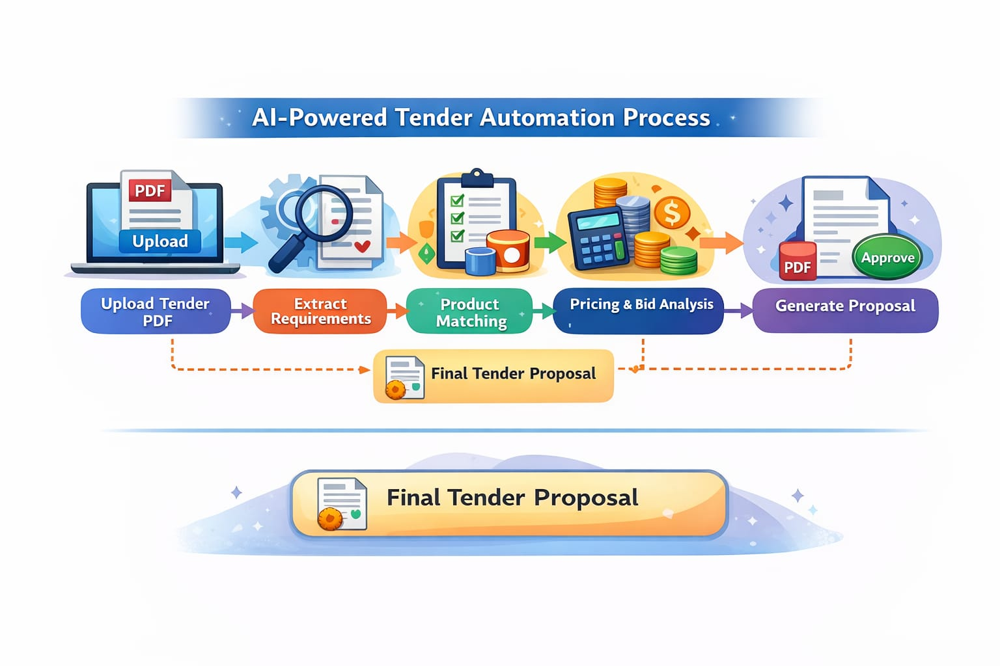

# AI Tender Automation System – FMCG (Asian Paints Use Case)

## Problem Overview
Large FMCG companies like Asian Paints process B2B RFPs and tenders manually. This involves reading complex tender PDFs, matching products, calculating bid prices, estimating margins, and preparing proposal documents. The process is time-consuming, error-prone, and inconsistent.

## Proposed Solution
AI Tender Automation System is an end-to-end, agentic AI platform that:
- Extracts tender requirements from PDFs
- Matches tender specs with available products
- Recommends pricing and discounts
- Predicts win probability
- Generates final tender proposal PDFs automatically

## Architecture

## Tech Stack
- Backend: Python, FastAPI
- Frontend: React.js
- AI/NLP: Rule-based parsing, scoring engines
- PDF Processing: PyMuPDF, ReportLab
- Deployment: Render (Backend), Vercel (Frontend)

## How to Run
Refer to SETUP_INSTRUCTIONS.md

## Demo
- Demo Video: demo/demo_video.mp4
- Screenshots: demo/screenshots/

## Build Reproducibility
Refer to BUILD_REPRODUCIBILITY.md
